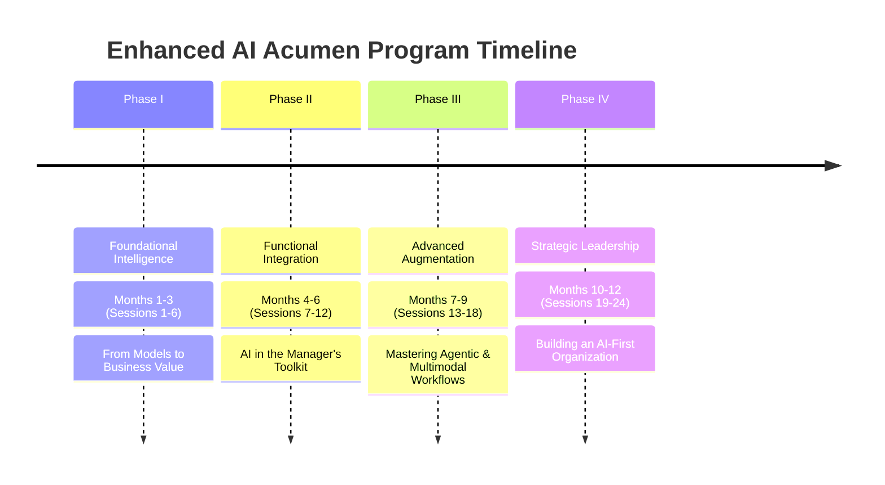
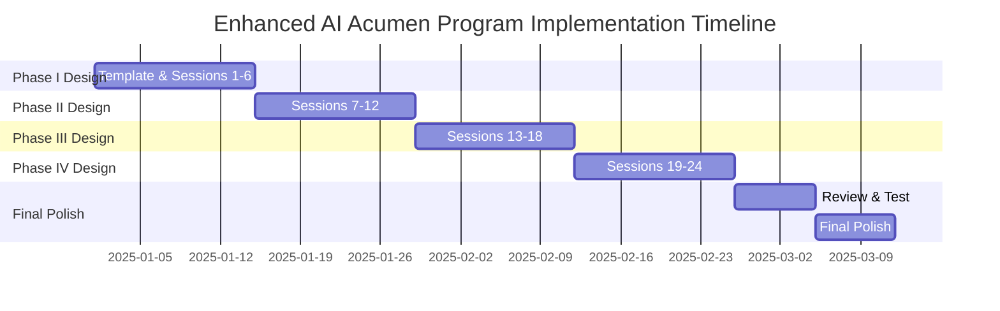

# Enhanced AI Acumen Program
*A Strategic Framework for Management Training (2025-2026)*

**24 Sessions • 15 Minutes Each • Complete Presentation Guide**

## Program Overview

The Enhanced AI Acumen Program is designed to transform managers from AI novices to confident orchestrators of human-AI collaboration over 12 months. This comprehensive training program provides the competitive advantage needed for the 2026 business landscape.

---

## Quals: Umasankr Udhya

**Professional Journey**
- **25 years of experience** in technology and strategy, with **20 years at Deloitte**
- **ML & AI Specialist** with deep expertise in Natural Language Processing (NLP)
- **Academic Foundation:** Texas McCombs School of Business, Austin, TX - AI/ML
- **Active Practitioner:** Kaggle competitor and ML community contributor (2012-2018)

**Current Leadership Role**
- **Lead Strategy & Innovation** in ITSM Modernization and Continual Improvement
- **Service Assurance, OCIO** - driving enterprise transformation initiatives
- **Spearheading futuristic projects** supporting DT-US Transformation Priorities:
  - Enterprise Data Capability through FyniteAI
  - ServiceNow Transformation
  - AI-driven Service Design innovation

**AI Passion & Investment**
- **$3,000+ invested** in AI experimentation and learning since ChatGPT's release
- **Premium subscriptions:** Gemini, Anthropic's Claude Code (Sonnet 4 & Opus 4)
- **Development tools:** v0, Lovable, advanced image & video generation platforms
- **Personal sacrifice:** Trading cycling and badminton for AI mastery (worth every hour ?!?)

**The Human Side**
- **Proud father** of two brilliant daughters (15 & 13) who consider me their personal "tech support lifeline"
- **Can't say no** to helping them navigate our digital world (and wouldn't want to!)
- **Currently building an AI-Tutor app** for my kids to get additional help at home
- **Vision:** A perfect 'human-centric' AI Tutor that understands its students extremely well at all times

*"My mission: Transform complex AI concepts into practical business advantages you can implement immediately."*

### Program Structure

## Phase I: Foundational Intelligence
*Months 1-3 • Sessions 1-6 • From Models to Business Value*

### Session 1: The AI Landscape: Beyond the Hype

**🎯 Objective:** Equip managers with strategic understanding of key AI players and their distinct philosophies for informed platform selection decisions.

**📋 Agenda (15 minutes):**
- **(5 min) The Three AI Ecosystems**
  - **OpenAI**: "The Reasoning Engine" - Advanced problem-solving (o-series models)
  - **Google**: "The Integrated Workflow" - Seamless productivity integration (Workspace)
  - **Anthropic**: "The Trusted Partner" - Safety & reliability focus (Claude)

- **(7 min) Exercise: "Platform-Problem Fit"**
  Match business scenarios to optimal platforms:
  1. M&A due diligence document analysis → Claude
  2. Creative marketing slogans → GPT
  3. Automated Google Sheets reports → Gemini

- **(3 min) Takeaway & Playbook Entry**
  Strategic AI Platform Comparison Guide added to Manager's AI Playbook

**AI Platform Comparison Matrix:**

| Platform | Core Philosophy | Key Strengths (2025) | Ideal Use Cases |
|----------|-----------------|---------------------|-----------------|
| **OpenAI** | Reasoning Engine | Advanced reasoning, creative generation, agentic capabilities | Complex problem-solving, research, code generation |
| **Google** | Integrated Workflow | Workspace integration, multimodal capabilities, enterprise agents | Business process automation, collaborative content |
| **Anthropic** | Trusted Partner | Large context window, low hallucination, safety focus | Legal/financial analysis, compliance monitoring |

**🎯 Speaker Notes:**
- **Opening:** "We're not here to get caught up in AI hype. We're here to make strategic decisions. Let's cut through the noise and understand what really matters for business."
- **Key Point:** Emphasize that platform choice should be driven by specific business needs, not marketing claims.
- **Exercise Facilitation:** Give participants 2 minutes to think, then facilitate quick discussion of their reasoning.

---

### Session 2: Understanding AI Business Value & ROI

**🎯 Objective:** Establish realistic expectations for AI ROI and learn frameworks for measuring business value beyond simple cost savings.

**📋 Agenda (15 minutes):**
- **(5 min) The AI ROI Reality Check**
  - Only 17% of organizations see tangible EBIT impact from AI
  - 80% struggle to demonstrate business value from GenAI
  - Success requires strategic approach, not just technology deployment

- **(7 min) Exercise: "ROI Beyond Cost Savings"**
  Identify 3 ways AI could create value in your department:
  1. Direct cost reduction
  2. Revenue enhancement
  3. Strategic advantage (speed, quality, insights)

- **(3 min) Takeaway & Playbook Entry**
  AI Value Framework Template for tracking both quantitative and qualitative benefits

**💼 Interactive Exercise: "The ROI Reality Simulator"**
Present three scenarios:
- **Scenario A:** Chatbot saves 2 hours/week per employee (quantifiable)
- **Scenario B:** AI insights lead to better strategic decisions (harder to measure)
- **Scenario C:** AI tool improves employee satisfaction and retention (long-term impact)

Participants rank these by ROI potential and discuss measurement challenges.

**🎯 Speaker Notes:**
- **Key Message:** "AI ROI isn't just about efficiency - it's about transformation. We need to think beyond 'how much time did we save' to 'how much better are our decisions.'"
- **Address Skepticism:** Acknowledge that many AI projects fail to show ROI. This is why we're taking a strategic approach.
- **Real Data:** Share that companies with formal AI strategies see 80% success rates vs. 37% without strategy.

---

### Session 3: Prompt Engineering is Not Enough: Intro to Context Engineering

**🎯 Objective:** Shift mental model from "asking AI questions" to "architecting the information environment" for better results.

**📋 Agenda (15 minutes):**
- **(5 min) Defining Context Engineering**
  Introduce the PTCF Framework:
  - **P**ersona (who the AI should be)
  - **T**ask (what it should do)
  - **C**ontext (external knowledge to use)
  - **F**ormat (how output should be structured)

- **(7 min) Exercise: "Context Injection"**
  Compare two approaches:
  - Generic: "Summarize this article"
  - vs. Context-Rich: "Act as Senior Financial Analyst. Summarize for CEO considering sector investment. Focus on growth, threats, risks. Format as 3 bullet points."

- **(3 min) Takeaway & Playbook Entry**
  PTCF Prompt Template for systematic prompt construction

**💼 Live Demonstration: "Before & After Context"**
Show actual AI outputs from generic vs. PTCF-structured prompts using the same source material. The difference in quality and relevance will be immediately apparent.

**🎁 Playbook Entry: PTCF Template**
- **Persona:** "Act as a [role] with expertise in [domain]"
- **Task:** "Your task is to [specific action] for [audience]"
- **Context:** "Using [data source], considering [constraints/requirements]"
- **Format:** "Structure your response as [specific format]"

**🎯 Speaker Notes:**
- **Key Analogy:** "Think of AI like a brilliant consultant who knows nothing about your business. Context engineering is like giving them your company handbook, org chart, and project requirements before asking for advice."
- **Common Mistake:** "Most people treat AI like Google search. We're going to treat it like a skilled employee who needs proper briefing."

---

### Session 4: The Foundation of Modern AI: Retrieval-Augmented Generation (RAG)

**🎯 Objective:** Demystify RAG technology that allows AI to securely use organization's private, proprietary knowledge.

**📋 Agenda (15 minutes):**
- **(5 min) RAG in Business Terms**
  Simple analogy: "Giving AI a targeted, just-in-time library to read before answering"
  - Difference between asking expert from memory vs. with company handbooks
  - Reduces hallucinations, grounds answers in facts

- **(7 min) Exercise: "RAG vs. Fine-Tuning"**
  Two scenarios:
  1. Customer service chatbot with Q3-2025 product specs (weekly updates) → RAG
  2. Marketing copy matching company's quirky brand voice → Fine-tuning

- **(3 min) Takeaway & Playbook Entry**
  "When to Use RAG" Checklist for identifying opportunities

**🎯 Speaker Notes:**
- **Key Point:** "RAG is like giving your AI employee access to your company's Google Drive, but smarter and more secure."
- **Business Impact:** "This is what makes AI truly valuable for your specific business - it knows YOUR data, YOUR policies, YOUR context."

---

### Sessions 5-6 Summary

**Session 5: Data Fundamentals for AI Success** - Understanding data quality, preparation, and governance basics that make AI projects succeed or fail.

**Session 6: AI Safety & Risk Management** - Practical approaches to identifying and mitigating AI risks in business contexts.

---

## Phase II: Functional Integration
*Months 4-6 • Sessions 7-12 • AI in the Manager's Toolkit*

### Session 7: The Strategic Co-Pilot: AI for Market Analysis & Planning

**🎯 Objective:** Empower managers to use AI as sophisticated partner in strategic analysis, moving beyond simple information retrieval.

**📋 Agenda (15 minutes):**
- **(5 min) AI as Reasoning Partner**
  - Modern LLMs perform complex reasoning, not just pattern matching
  - OpenAI's "Deep Research" agent example
  - Delegating cognitive-heavy research tasks

- **(7 min) Exercise: "SWOT Analysis Generation"**
  Practice with structured prompt template:
  "Act as senior strategy consultant for [industry]. Conduct SWOT analysis for [Company]. Provide 3+ points per quadrant with evidence-based justification."

- **(3 min) Takeaway & Playbook Entry**
  Strategic Analysis Prompt Library (SWOT, PESTLE, competitive intelligence)

**💼 Hands-On Exercise: "Strategic Analysis in Action"**
Participants fill in bracketed information for their actual business context and see immediate results. This makes the learning directly applicable to their real work.

---

### Sessions 8-12 Overview

**Session 8:** AI-Augmented HR (detailed in original document)
**Session 9:** AI in Finance & Accounting - Invoice processing, contract analysis, financial forecasting
**Session 10:** Supply Chain & Operations (detailed in original document)
**Session 11:** AI-Powered Marketing & Sales - Personalization, campaign optimization, CRM intelligence
**Session 12:** Legal & Compliance Applications - Contract review, risk assessment, regulatory monitoring

---

## Phase III: Advanced Augmentation
*Months 7-9 • Sessions 13-18 • Mastering Agentic & Multimodal Workflows*

### Session 13: Thinking in Pictures: Leveraging Multimodal AI for Business Intelligence

**🎯 Objective:** Train managers to use image, chart, and data visualization inputs for deeper business insights.

**📋 Agenda (15 minutes):**
- **(5 min) Unlocking Visual Data**
  - 60% of enterprise apps will be multimodal by 2026
  - Examples: Retail shelf analysis, financial chart interpretation
  - Beyond text-only limitations

- **(7 min) Exercise: "Chart-to-Insight"**
  Upload sales performance chart with prompt:
  "Analyze attached chart. What are top 3 takeaways for senior management? What business risk should we investigate?"

- **(3 min) Takeaway & Playbook Entry**
  Multimodal Analysis Prompt Framework for different visual inputs

---

### Sessions 14-18 Overview

**Session 14:** Advanced Data Analysis with AI - Statistical modeling, predictive analytics
**Session 15:** Introduction to Agentic AI (detailed in original document)
**Session 16:** Building Team Knowledge Base with Advanced RAG (detailed in original document)
**Session 17:** AI Integration & APIs - Connecting AI to existing business systems
**Session 18:** Measuring AI Performance - KPIs, metrics, and continuous improvement

---

## Phase IV: Strategic Leadership
*Months 10-12 • Sessions 19-24 • Building an AI-First Organization*

### Session 19: Leading AI Adoption: The Change Management Challenge

**🎯 Objective:** Equip managers with strategies for overcoming team resistance and fostering positive AI adoption culture.

**📋 Agenda (15 minutes):**
- **(5 min) The Human Element of AI**
  - Frame AI as augmentation, not replacement
  - Focus on eliminating tedious tasks
  - Emphasize uniquely human strengths: creativity, relationships, strategic thinking

- **(7 min) Exercise: "Constructive Responses to Objections"**
  Address common concerns:
  1. "AI will make my job obsolete"
  2. "I don't have time to learn another tool"
  Brainstorm empathetic, constructive responses

- **(3 min) Takeaway & Playbook Entry**
  AI Change Management Talking Points for difficult conversations

**🎯 Speaker Notes:**
- **Addressing Fear:** "Research shows 85 million jobs may be displaced by AI, but 97 million new roles will emerge. We're preparing for the future, not fighting it."
- **Success Stories:** Share examples of companies where AI adoption improved employee satisfaction by reducing mundane tasks.

---

### Sessions 20-24 Overview

**Session 20:** Building AI-Ready Teams - Skills development, hiring strategies, organizational design
**Session 21:** AI Governance & Ethics (detailed in original document)
**Session 22:** Future-Proofing Your AI Strategy - Preparing for emerging technologies and market changes
**Session 23:** Advanced AI Leadership - Leading in an AI-augmented world, strategic decision-making
**Session 24:** Capstone Session (detailed in original document)

---

### Session 24: Capstone: Presenting Your AI Playbook & Future-Proofing Strategy

**🎯 Objective:** Consolidate learning, reflect on AI Playbook value, and create personal roadmap for continued AI leadership development.

**📋 Agenda (15 minutes):**
- **(5 min) The Next Wave of AI**
  Future trends through 2027:
  - AI in scientific discovery
  - Advanced reasoning and planning capabilities
  - Specialized language models (SLMs) for specific tasks

- **(7 min) Exercise: "My 2027 AI Vision"**
  Write vision statement:
  "Based on future trends, outline one ambitious but achievable goal for leveraging AI in your role/department by 2027"

- **(3 min) Final Playbook Entry**
  Personal AI Leadership Development Plan with specific next-year commitments

**🎁 Program Completion Certificate Elements**
- Completed Manager's AI Playbook (24 sections)
- Strategic AI implementation roadmap
- Personal leadership development plan
- Network of AI-savvy managers across organization

---

## Design & Implementation Guidelines

### Template & Design Specifications

**Font Family:** Open Sans (Google Fonts) - Professional, clean, highly readable

**Color Palette:**
- Primary: #667eea (Modern Blue)
- Secondary: #764ba2 (Purple)
- Accent: #28a745 (Success Green)
- Warning: #ffc107 (Amber)
- Background: #f8f9fa (Light Gray)

### Slide Layout Standards
- **Title Slides:** 32pt title, 24pt subtitle, centered
- **Content Slides:** 28pt heading, 18pt body text, 16pt details
- **Table Text:** 14pt minimum for readability

### Required Slide Types Per Session
1. **Session Title Slide** - Session number, title, duration, objective
2. **Agenda Slide** - 3 main components with time allocation
3. **Concept Slides** - 2-3 slides explaining core concepts
4. **Exercise Slide** - Interactive activity with clear instructions
5. **Takeaway Slide** - Playbook entry and key learnings
6. **Break/Transition Slide** - End of session marker

### Visual Elements to Include
- Infographics for data visualization (use tools like Canva or PowerPoint SmartArt)
- Icons from professional icon sets (Flaticon, Noun Project)
- Process flow diagrams for complex concepts
- Screenshot examples of AI interfaces
- Charts and graphs for statistics and trends

### Interactive Elements
- Polling questions for audience engagement
- Breakout discussion topics
- Real-time exercises with AI tools
- Case study scenarios

### Speaker Notes Guidelines
- Include talking points for each slide
- Add transition phrases between concepts
- Note timing for each section
- Include backup examples and analogies
- Add facilitation tips for exercises

---

## Additional Resources & References

### Recommended Business Templates
- **SlidesCarnival:** Modern business templates with Open Sans font support
- **Canva for Work:** Professional presentation templates
- **Microsoft 365 Templates:** Built-in business presentation themes

### Stock Images & Icons
- **Unsplash Business:** High-quality business photography
- **Flaticon:** Professional icon sets
- **Noun Project:** Consistent iconography

### Data Visualization Tools
- **PowerPoint SmartArt:** Built-in diagram tools
- **Canva Charts:** Professional infographic creation
- **Excel Integration:** For live data charts

### Implementation Timeline

**Week 1-2:** Design template and create Phase I slides (Sessions 1-6)
**Week 3-4:** Develop Phase II content (Sessions 7-12)
**Week 5-6:** Build Phase III advanced content (Sessions 13-18)
**Week 7-8:** Complete Phase IV strategic content (Sessions 19-24)
**Week 9:** Review, refine, and test presentation flow
**Week 10:** Final polish and speaker note completion